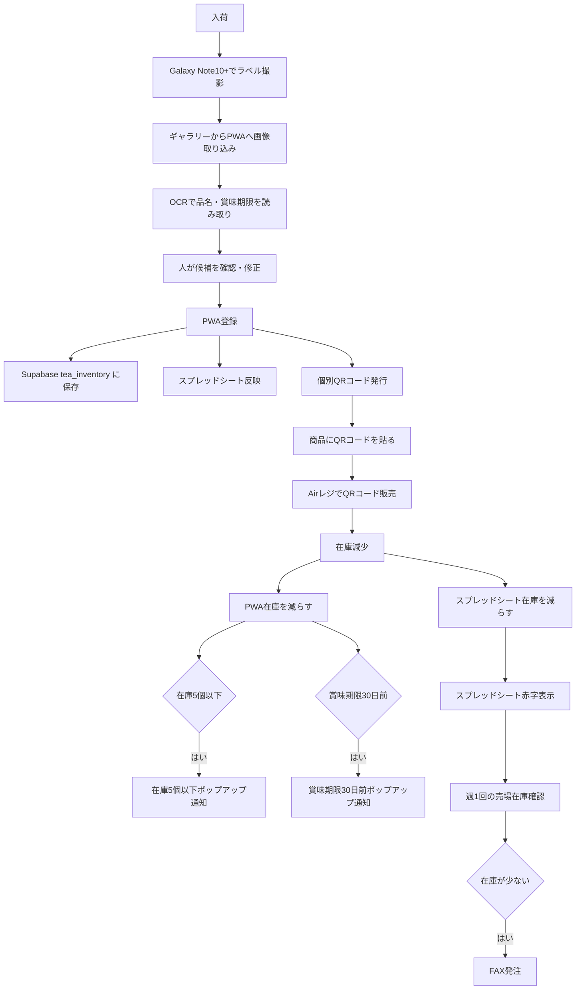

# お茶在庫管理PWA 今後の全体構成メモ

## 1. 全体の目的

お茶の入荷、賞味期限、在庫数をPWAで管理し、将来的にはスプレッドシート、QRコード、Airレジ、発注作業までつなげる。

新しく別アプリを作り直すのではなく、現在の `tea-inventory-pwa` に段階的に機能を追加していく。

## 2. 現在のPWAでできていること

- お茶の入荷登録
- OCR読み取り
- 写真から読み取る
- 写真から一括読み取り
- 商品名対応表
- 賞味期限読み取り
- 在庫一覧
- 要対応一覧
- 在庫データの編集
- 在庫データの削除
- Supabase の `tea_inventory` テーブルへの保存

## 3. 今後追加したい機能

- スプレッドシートへの反映
- 袋入りお茶ごとの個別QRコード発行
- QRコードを商品へ貼り付ける運用
- AirレジでQRコードを読み込んだ販売
- 販売後の在庫減少処理
- PWAで在庫5個以下のポップアップ通知
- PWAで賞味期限30日前のポップアップ通知
- スプレッドシートで在庫不足・期限近いものを赤字表示
- 週1回の売場在庫確認フロー
- FAX発注につなげる確認フロー

## 4. フローチャート

## 5. 段階ごとの実装順

### 第1段階：現在のPWAを安定させる

- OCR候補カードの使いやすさ改善
- 入荷登録の確認画面改善
- 在庫一覧・要対応一覧の見やすさ改善

### 第2段階：スプレッドシート連携

- PWA登録内容をスプレッドシートにも反映
- スプレッドシート側で在庫不足・期限近いものを赤字表示

### 第3段階：QRコード発行

- 入荷登録後、在庫1単位ごとのQRコードを発行
- QRコードに何の情報を入れるか決める
- 印刷しやすい画面を作る

### 第4段階：Airレジ販売との連携

- AirレジでQRコードを読み取って販売できるか調査
- Airレジ側で扱える商品コード形式を確認
- 売れた後にPWA在庫を減らす方法を検討

### 第5段階：通知機能

- 在庫5個以下のポップアップ通知
- 賞味期限30日前のポップアップ通知
- 通知の出し方をPWA通知にするか、画面内通知にするか決める

### 第6段階：発注フロー

- 週1回の売場在庫確認
- 在庫不足商品の確認
- FAX発注用のメモまたは一覧出力

## 6. 追加調査が必要な部分

- AirレジがQRコード販売にどう対応しているか
- Airレジへ外部アプリから在庫数を反映できるか
- AirレジAPIが使えるか
- AirレジのCSV取り込み仕様
- QRコードに入れるべき情報
- スプレッドシート連携方法
- PWAのプッシュ通知がAndroidで安定して使えるか
- FAX発注を自動化するか、確認用リストだけにするか

## 7. 注意事項

- 画像は保存しない
- Supabase Storage は使わない
- Dropbox へ画像保存しない
- スマホ本体へ新しく画像保存する機能は追加しない
- OCR結果と人が確認した内容だけ保存する
- まずは安全に、人が確認してから登録する
- Airレジ連携は仕様確認後に進める
- 新しいアプリを作り直さず、現在のPWAへ段階的に追加する
